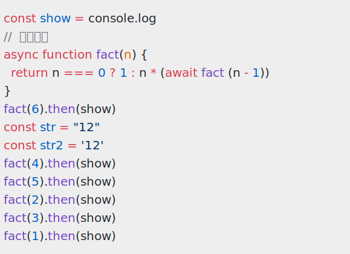

**shiki-renderer-svg-other**

**The package was not published on npmjs.com**


## Using

```ts
import { codeToTokens } from 'shiki'
import { getSVGRenderer } from 'shiki-renderer-svg-other'
import { writeFileSync } from 'node:fs'

  const str = `const show = console.log
//  注释注释
async function fact(n) {
  return n === 0 ? 1 : n * (await fact (n - 1))
}
fact(6).then(show)
const str = "12"
const str2 = '12'
fact(4).then(show)
fact(5).then(show)
fact(2).then(show)
fact(3).then(show)
fact(1).then(show)`

 const { tokens } = await codeToTokens(str, {
   lang: 'javascript',
   theme: 'github-light',
 })
 
const { renderToSVG } = getSVGRenderer({
   lineHeightRatio: 1.5,
})
const res = renderToSVG(tokens)

writeFileSync(new URL('./svg.svg', import.meta.url), res)
```


## The renderer result



## Developing

- clone this repository
- run `pnpm install`
- Run tests with `pnpm run test` 
- Coverage with `pnpm run coverage`
- Build with `pnpm run build`